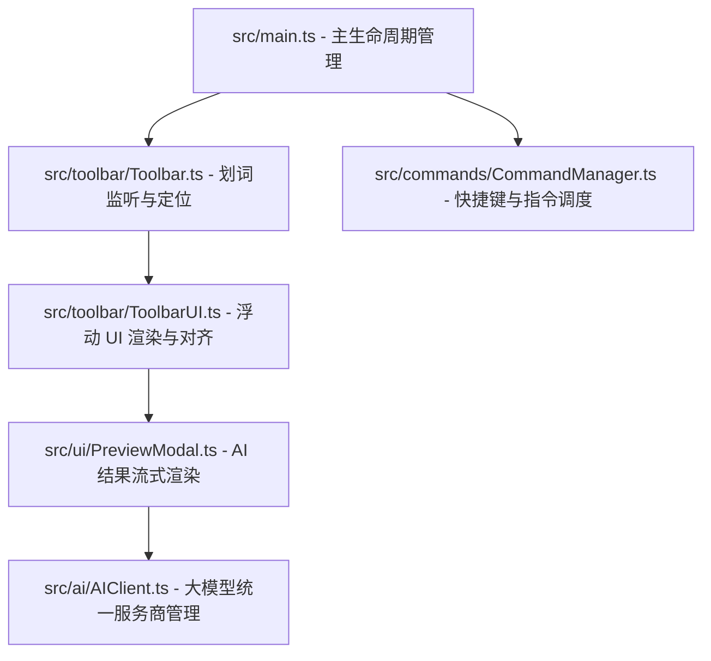

# SmartPick AI Agent 开发与维护指南 (AGENT.md)

> [!NOTE]
> 本文档专门面向 AI 协作 Agent（如 Antigravity, Codex）及人类开发者，系统性地图示了 SmartPick 项目的架构逻辑、高频踩坑避雷针、社区代码合规红线以及协作规范，确保后续的插件维护和二次开发能够保持极高的高水准与一致性。

---

## 1. 项目全局概述与核心愿景

**SmartPick** 是一款为 Obsidian 打造的**情境化智能划词辅助工具栏插件**。
用户在编辑器内选中文本后，系统会自动捕获选区并展示一个微型的浮动工具栏，支持：
1. **内置工具集 (Built-in Tools)**：粗体、下划线、上标/下标、创建代码块、一键清除格式、 Notion 风格的链接粘贴，以及文件/文本一键拷贝。
2. **自定义 AI 命令 (AI Prompts)**：集成多大模型服务商（OpenAI, Anthropic, Ollama），实现划词翻译、提炼总结、解释说明等 AI 流式输出。
3. **自定义网页搜索 (URL Search)**：将选中文本一键传送至 Google、百度、学术等搜索引擎。
4. **系统级快捷键绑定 (OS Shortcuts)**：绑定并智能调度系统级快捷操作。

---

## 2. 核心运行机制与架构模块

项目整体基于 TypeScript + ESBuild 构建，其核心架构由以下四个层次组成：



### 2.1 划词监听与触发 (`src/toolbar/`)
* **Toolbar.ts**：负责绑定编辑器 DOM 监听器。它在 `active-leaf-change` 事件时，智能绑定当前活动编辑器的 `.cm-content` 容器。
* **免打扰模式 (Quiet Mode)**：
  - 核心逻辑：监听 `mouseup` 与 `keyup` 原生事件。若开启 `enableModifierKeyTrigger` 开关，则在去抖动前同步捕获原生事件中的 `e.ctrlKey`、`e.metaKey`、`e.altKey`、`e.shiftKey`。
  - 通过 `Platform.isMacOS` 自动处理跨平台的 `CmdOrCtrl` 映射（Mac 上侦听 `metaKey`，Windows/Linux 上侦听 `ctrlKey`）。
  - 去抖动（Debounce）设置为严格的 **200ms**，完全消除了任何与全局系统快捷键（如 `Cmd+C`）的物理及时冲突。
* **双击快速逃逸**：支持双击快速选中单字并无条件弹出工具栏（若开启了双击触发选项），作为便捷的逃逸通道。

### 2.2 坐标计算与对齐 (`src/toolbar/ToolbarUI.ts`)
* **坐标获取**：通过对 CodeMirror 6 内部 API 的安全转换，利用 `editor.cm.coordsAtPos(pos)` 计算出字符所在的实际视口位置。
* **相对布局与 Clamp**：
  - 使用 `view.contentEl.createDiv()` 动态创建容器 `.smartpick-toolbar-container`，根据 `getBoundingClientRect()` 计算出容器相对偏移量。
  - 支持多行文本判断：当选区上下高度差超过 `1.5 * 行高` 时，自动在编辑器中线居中对齐；单行文本时，根据选区中心所处视口百分比，智能决定**靠左、靠右或居中**。
  - 边界安全防溢出（Clamp）：如果选区起始点过高（如 Select All 导致 top 为负），则强制将 top 限制在最小安全距离（如 `10px`），防止工具栏被视口顶端截断。

### 2.3 统一大模型客户端 (`src/ai/`)
* **AIClient.ts**：统一的大模型 API 调用接口，内置提示词变量（`{{selection}}` 等）的实时渲染，以及上下文长度的安全裁剪。
* **Providers**：
  - `OpenAIProvider.ts`：兼容标准的 OpenAI 接口格式，支持第三方代理。
  - `AnthropicProvider.ts`：对接 Claude 官方原生 API。
  - `OllamaProvider.ts`：智能读取本地 Ollama 服务端口，动态拉取当前本地已安装的模型列表，并执行本地流式推理。

### 2.4 流式 Markdown 预览 (`src/ui/PreviewModal.ts`)
* 继承自 Obsidian `Modal`，支持流式传输的 Markdown 解析与美化渲染，内置直接“替换选区”、“在选区后插入”或“一键拷贝至剪贴板”的功能。

### 2.5 项目完整文件职责树索引与 `/filetree` 自动化维护技能
* **单一事实来源 (SSOT)**：为了保持开发手册的简洁，并防止因代码修改导致的文件指纹哈希（Content Hash）在多处过期，项目内**所有具体代码与配置文件**的中文化一句话职责定义与位置索引，已统一归档于：
  👉 **[项目文件职责树索引 (FILETREE.md)](file:///Users/bcs/MacSync/SmartPick/smartpick/FILETREE.md)**
* **工具底层逻辑 (`/filetree` Skill)**：
  `FILETREE.md` 文件**严禁**人工手动编辑。它完全依赖本地工作区专用的 **`/filetree` 自动化维护技能库** 来进行扫描、哈希校验与摘要计算。
* **何时使用该技能 (Trigger Timings)**：
  1. **初始化配置 (`/filetree:init`)**：仅当项目初建、或者需要对文件目录结构重新梳理、清除旧缓存重建索引时运行。
  2. **日常增量更新 (`/filetree:update`)**：**高频触发！** 每当在二次开发中完成了代码修改、重构，或者涉及文件新增、重命名、删除，且完成本地测试验证无误后，必须在工作区根目录下触发 `/filetree:update` 命令。它会自动捕获修改过的文件、重新生成指纹哈希，并指导 AI 重新校验该文件的核心职责描述。
* **执行该技能时的硬性约束（Agent 必须遵守）**：
  在执行 `/filetree:update` 交互时，AI Agent 必须严格遵守以下两条底线规则：
  - **全中文一句话大宪章**：为新增或修改的文件编写摘要时，必须使用一句流畅、连贯的中文陈述句说明其“业务角色与职责功能”（以句号 `。` 结尾，拒绝半截子话和 `...` 截断，拒绝营销词汇）。例如：`"统一的大模型 API 调用接口；负责消息变量替换与上下文历史安全截断。"`。
  - **UNCHANGED 偏好 (UNCHANGED bias)**：如果一个代码文件的目的/职责并未发生改变（例如：仅进行了 Bug 修复、重构、样式微调、添加注释或测试用例），在更新扫描中必须无条件输出 `"UNCHANGED"`。这不仅能让脚本自动只刷新内容哈希并继承原有描述，更能避免文档审阅噪音，节省多达 100 倍的 Token 消耗。

---

## 3. 极高优先级：开发避坑与合规红线 (High Priority)

> [!WARNING]
> 以下四条是项目在升级至 `v0.6.7+` 过程中沉淀的硬性约束。任何二次开发和代码重构必须严格遵守，否则将无法通过 Obsidian 官方社区的审核或导致生产环境崩溃！

### 3.1 多开窗口与 Popout 适配规范（防内存泄露与 UI 崩溃）
* **痛点**：Obsidian 在 v1.0 之后支持弹窗多开（Popout Window），此时主窗口的 `document` 与弹出窗口的 `document` 实例是完全隔离的。若使用全局 `document.addEventListener`，在子窗口中会无法捕获事件，或者在往子窗口插入节点时报 `HierarchyRequestError`。
* **避坑红线**：
  - **严禁**直接引用全局 `document` 或 `window`。
  - **必须**使用 Obsidian 推荐的 `activeDocument` 和 `activeWindow`。
  - 在渲染 UI 组件（如 `ToolbarUI`）时，必须通过 `view.contentEl` 来创建或挂载 DOM，确保元素挂载在当前 Leaf 所在的物理窗口内。
  - 所有全局事件监听器（如 ESC 键监听、ClickOutside 监听）必须绑定在 `activeDocument` 上，且在插件卸载（`onunload`）或组件销毁（`destroy`）时必须**严格解绑**，防止造成严重的内存泄露。

### 3.2 严禁滥用 `!important` 与 CSS 特异性控制
* **痛点**：由于 Obsidian 社区主题的多样性，开发者为了保证工具栏不被主题样式篡改，极易滥用 `!important`。这在官方社区审核中属于**一票否决**的违规行为。
* **避坑红线**：
  - 工具栏所有样式均通过 `styles.css` 进行控制。
  - **严禁**在样式文件中使用 `!important` 声明（第三方依赖样式重置除外，但应极力避免）。
  - 应通过提升 **CSS 选择器特异性 (Specificity)** 来确保样式优先级。例如，使用 `button.smartpick-toolbar-button` 覆盖 `.smartpick-toolbar-button`，或者以祖先容器 `.smartpick-toolbar-container .smartpick-toolbar button` 来锁定层级。

### 3.3 Electron 原生剪贴板拷贝文件实体（文件复制痛点）
* **痛点**：若用户希望直接将 Obsidian 的当前笔记作为文件实体（Attachment）拷贝并直接粘贴进 ChatGPT、Claude 网页端或微信等软件中，普通的 `navigator.clipboard.writeText(fullPath)` 只会拷贝成一串文本路径，无法被系统识别为文件实体。
* **解决方案**：
  - 在 `src/main.ts` 的 `copy-note-file` 指令中，智能检测当前宿主环境（仅在桌面端且 `adapter instanceof FileSystemAdapter` 时执行）。
  - 通过 `window.require('electron')` 动态加载 Electron 剪贴板模块。
  - 在 macOS 系统下，必须利用 `clipboard.writeBuffer('public.file-url', Buffer.from(fileUrl, 'utf-8'))` 协议 Buffer 写入剪贴板；在 Windows/Linux 系统下，采用 `clipboard.write({ filenames: [fullPath], text: fullPath })` 进行兼容性 fallback。
  - 这种设计打通了从 Obsidian 划词复制文件到第三方应用粘贴附件的物理通道。

### 3.4 社区安全审查红线：零 `innerHTML` 规范
* **避坑红线**：
  - 为了杜绝 XSS 注入风险，整个项目**严禁**使用 `element.innerHTML` 或 `element.outerHTML` 来渲染未知或用户输入的数据。
  - DOM 节点的创建和组装必须全部使用 `createEl`、`createDiv`、`appendChild` 并结合 `setText` 等原生安全方法进行。
  - 若必须渲染大模型生成的 Markdown 流式文本，必须采用 Obsidian 官方提供的安全 Markdown 解析渲染 API `MarkdownRenderer.render`，绝对不可手写正则并配合 `innerHTML` 进行挂载。

### 3.5 结合 `/vibe-obsidian-dev` 专属 Vibe Coding 开发及安全规范
在日常修改或二次开发 SmartPick 插件时，AI Agent 与人类开发者必须严格应用本地配置的 **`/vibe-obsidian-dev`** 专属开发技能库，其核心编码规范汇总如下：

1. **元素创建优先级 (DOM Element Creation)**
   - 严禁使用全局 `document.createElement()`。
   - 独立 `div` / `span` 必须使用 `activeDocument.createDiv()` / `activeDocument.createSpan()`。
   - 子节点创建**首选** `parentEl.createDiv({ cls, attr })` 与 `parentEl.createSpan({ cls, attr })`。
   - 仅对**非 div/span** 标签（如按钮、输入框、图片）使用 `parentEl.createEl("button", ...)` / `parentEl.createEl("input", ...)`。

2. **多窗口/弹窗兼容对照表 (Popout Compatibility Matrix)**
   | ❌ 严禁使用 | ✅ 推荐替换为 | 核心原因 |
   |:---|:---|:---|
   | `document.createElement("div")` | `activeDocument.createDiv()` | Popout 子窗口拥有其独立的 Document 实例 |
   | `document.body` | `activeDocument.body` | 主窗口与 Popout 窗口的 Body 容器不同 |
   | `document.addEventListener(...)` | `activeDocument.addEventListener(...)` | 事件捕获必须精确定位正确的 Document 视口 |
   | `setTimeout()` / `clearTimeout()` | `activeWindow.setTimeout()` | 定时器需要与窗口生命周期保持绑定 |
   | `window.getSelection()` | `activeWindow.getSelection()` | 选区作用域在弹窗下处于不同实例 |

3. **类型安全与代码整洁度 (Type Safety & ESLint)**
   - **禁止 `any` 类型**：对第三方不确定类型或 `loadData()` 必须进行精准类型断言（如 `await this.loadData() as Partial<SmartPickSettings> | null`）。
   - **未使用的参数**：对于回调函数中未使用但必须声明的形参，变量名必须添加下划线前缀（如 `_view: EditorView`）。
   - **空捕获块 (Empty Catch)**：严禁使用没有任何内容的捕获块 `try { ... } catch {}`，必须在其中添加单行注释解释原因。
   - **ESLint 规则规避**：严禁使用无任何规则定义的 blanket 禁用注释（如 `// eslint-disable-next-line`）。必须具体指出规避规则并附加说明理由，例如：
     ```typescript
     // eslint-disable-next-line @typescript-eslint/no-explicit-any -- Obsidian 官方 API 返回未定义类型的数据
     ```

4. **UI 文本设计规范 (UI Style Standards)**
   - 插件中所有 UI Label 及 Tooltip 必须使用**句首字母大写 (Sentence case)**（例如，使用 `"Show current time"`，而不是 `"Show Current Time"`）。
   - 注册指令名称（Command Name）**严禁**包含插件名前缀 `"SmartPick"`，Obsidian 平台会自动进行前缀拼接。

---

## 4. 开发构建与测试调试

### 4.1 开发依赖安装
在 `smartpick/` 子目录下执行：
```bash
npm install
```

### 4.2 开发实时热编译 (Watch Mode)
```bash
npm run dev
```
此命令会调用 `esbuild.config.mjs`，在开发状态下实时监听 `src/` 下所有 TypeScript 源码的变更，并增量编译、快速打包输出至 `smartpick/main.js`。此时将 Obsidian 的 SmartPick 插件打开，即可实现免重启的即时调试。

### 4.3 生产环境构建打包
```bash
npm run build
```
执行代码压缩、依赖混淆，生成符合发布标准的单文件生产包。

---

## 5. PRD 文档规范与 Agent 协作流程

为了保持工作区的高效与可追溯性，本项目严格执行 **PRD 内部文档闭环管理规范**。

### 5.1 `PRD/` 目录结构与职责
在工作区根目录下（注意：是外层根目录，而非子项目 `smartpick/`），维护有一个专属的 `PRD/` 文件夹：
* `requirements.md`：提取并沉淀各功能迭代的标准需求文档。
* `walkthrough.md`：详细记录每次重大特性开发的技术路径与测试情况。
* `communication_log.md`：汇总保存历次核心沟通记录与技术决策。
* `changelog.md`：持续维护并更新项目的更新日志。
* `dev_log.md`：记录开发过程中的关键思考、深度痛点排查与技术思考。

### 5.2 安全与隔离原则
* **PRD 文件夹绝对不可提交至 GitHub**。根目录的 `.gitignore` 中已强制包含 `PRD/`，以防止内部决策和敏感开发数据泄露。
* **FILETREE 缓存隔离**：项目使用 `FILETREE.md` 缓存代码文件职责。为防止污染开源主线，`.gitignore` 中必须始终将 `FILETREE.md` 排除。

### 5.3 AI Agent 开发建议（对 Codex 及后来者的建议）
1. **先看 PRD，再改代码**：在对插件发起任何修改前，务必优先通读 `PRD/requirements.md` 与 `PRD/dev_log.md`，理解历史业务逻辑和当前变更目标。
2. **事件解绑完整性**：每次修改 `Toolbar.ts` 或 DOM 监听时，必须在对应的 `destroy` 或 `onunload` 方法里将事件完全解绑。
3. **保持国际化多语言一致性**：新添任何 UI 文字或设置描述，切记在 `src/i18n.ts` 中同步配置中英文翻译字串。
4. **日志维护义务**：在完成任意功能修改并验证通过后，必须同步更新 `PRD/changelog.md`、`PRD/dev_log.md` 以及 `PRD/communication_log.md`，并在工作区根目录执行 `/filetree:update` 保持文件树描述最新。
